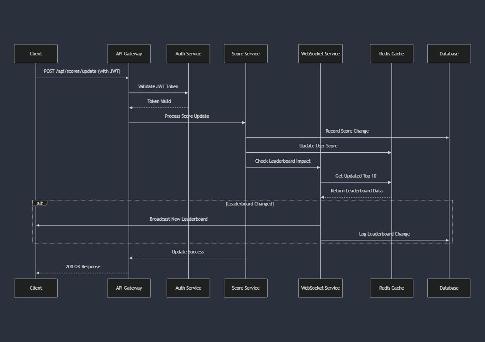

# Live Scoreboard System Specification

## System Overview
A real-time scoreboard system that securely tracks user scores and maintains a live top 10 leaderboard with WebSocket updates.

## System Flow Diagram


## Core Components

### 1. Authentication Service
- Handles user authentication
- Issues and validates JWT tokens
- Prevents unauthorized access

### 2. Score Management Service
- Processes and validates score updates
- Maintains score history
- Ensures data integrity

### 3. Leaderboard Service
- Manages top 10 rankings
- Processes real-time updates
- Broadcasts changes to clients

### 4. WebSocket Service
- Handles real-time client connections
- Broadcasts leaderboard updates
- Manages connection events

## Rate Limiting Specifications

### API Rate Limits
- Score updates: Maximum 10 per minute per user
- Authentication attempts: Maximum 5 per minute per IP
- Leaderboard requests: Maximum 30 per minute per IP

### WebSocket Rate Limits
- Maximum connections: 5 per user
- Message rate: 20 messages per minute per connection
- Reconnection attempts: 5 per minute

### IP-Based Limits
- Global rate limit: 100 requests per minute per IP
- Concurrent connections: 10 per IP
- Failed attempts threshold: 50 per hour triggers temporary ban

## Action Validation

### Valid Action Types
```json
{
    "GAME_COMPLETION": {
        "max_score": 100,
        "cooldown": "1 minute",
        "validation": "game_session_id required"
    },
    "ACHIEVEMENT_UNLOCK": {
        "max_score": 50,
        "cooldown": "none",
        "validation": "achievement_id required"
    },
    "DAILY_CHALLENGE": {
        "max_score": 200,
        "cooldown": "24 hours",
        "validation": "challenge_completion_proof required"
    }
}
```

### Validation Rules
1. Action must have a valid type
2. Score increment must not exceed maximum for action type
3. Cooldown period must be respected
4. All required validation fields must be present
5. Action timestamp must be within acceptable range

### Anti-Cheat Measures
1. Server-side verification of all actions
2. Cross-reference with game session data
3. Pattern analysis for suspicious activity
4. Multiple validation failure tracking
5. Automated temporary bans for suspicious activity

## Error Scenarios and Handling

### 1. Invalid Action Attempt
```json
{
    "error": "INVALID_ACTION",
    "message": "Action validation failed",
    "details": {
        "reason": "cooldown_period_active",
        "retry_after": "125 seconds"
    },
    "status": 400
}
```

### 2. Rate Limit Exceeded
```json
{
    "error": "RATE_LIMIT_EXCEEDED",
    "message": "Too many requests",
    "details": {
        "limit": 10,
        "reset_at": "2024-01-05T12:00:00Z"
    },
    "status": 429
}
```

### 3. WebSocket Connection Loss
- Automatic reconnection attempt with exponential backoff
- State synchronization upon reconnection
- Missed updates recovery mechanism

### 4. Database Inconsistency
- Transaction rollback
- Automatic consistency check
- Admin notification
- User-friendly error message

### 5. Token Expiration
- Automatic token refresh attempt
- Grace period for renewal
- Clear error message with instructions

## Security Measures

### 1. Authentication
- JWT-based authentication with short expiry
- Refresh token rotation
- HTTPS enforcement
- Session invalidation on suspicious activity

### 2. Score Protection
- Rate limiting on multiple levels
- Action validation with server-side verification
- Score change validation against action rules
- Comprehensive audit logging

### 3. WebSocket Security
- Connection authentication with token
- Message signature validation
- Rate limiting per connection
- Payload size limits

## Database Structure

```sql
-- Users table
users (
    id UUID PRIMARY KEY,
    username VARCHAR(50) UNIQUE NOT NULL,
    email VARCHAR(255) UNIQUE NOT NULL,
    password_hash VARCHAR(255) NOT NULL,
    status VARCHAR(20) DEFAULT 'active',
    last_action_at TIMESTAMP,
    suspicious_activity_count INTEGER DEFAULT 0,
    created_at TIMESTAMP DEFAULT CURRENT_TIMESTAMP
)

-- Scores table
scores (
    id UUID PRIMARY KEY,
    user_id UUID REFERENCES users(id),
    score INTEGER NOT NULL DEFAULT 0,
    action_type VARCHAR(50) NOT NULL,
    action_metadata JSONB,
    verification_status VARCHAR(20) DEFAULT 'verified',
    timestamp TIMESTAMP DEFAULT CURRENT_TIMESTAMP,
    CONSTRAINT valid_score CHECK (score >= 0)
)

-- Score history
score_history (
    id UUID PRIMARY KEY,
    user_id UUID REFERENCES users(id),
    score_change INTEGER NOT NULL,
    previous_score INTEGER NOT NULL,
    new_score INTEGER NOT NULL,
    action_type VARCHAR(50) NOT NULL,
    action_metadata JSONB,
    verification_status VARCHAR(20) DEFAULT 'verified',
    timestamp TIMESTAMP DEFAULT CURRENT_TIMESTAMP
)

-- Rate limiting
rate_limits (
    id UUID PRIMARY KEY,
    user_id UUID REFERENCES users(id),
    ip_address VARCHAR(45),
    action_type VARCHAR(50),
    request_count INTEGER DEFAULT 1,
    first_request_at TIMESTAMP DEFAULT CURRENT_TIMESTAMP,
    last_request_at TIMESTAMP DEFAULT CURRENT_TIMESTAMP
)

-- Suspicious activity
suspicious_activities (
    id UUID PRIMARY KEY,
    user_id UUID REFERENCES users(id),
    ip_address VARCHAR(45),
    activity_type VARCHAR(50),
    details JSONB,
    timestamp TIMESTAMP DEFAULT CURRENT_TIMESTAMP
)
```

## API Endpoints

### Authentication
```
POST /api/auth/login
POST /api/auth/register
POST /api/auth/refresh-token
POST /api/auth/logout
```

### Score Management
```
POST /api/scores/update    # Protected
GET /api/scores/user/:id   # Protected
GET /api/leaderboard      # Public
GET /api/scores/history   # Protected
```

## WebSocket Events

### Client to Server
```javascript
// Subscribe to leaderboard
{
    type: 'subscribe_leaderboard'
}

// Acknowledge update
{
    type: 'ack_update',
    data: {
        updateId: string,
        timestamp: string
    }
}
```

### Server to Client
```javascript
// Leaderboard update
{
    type: 'leaderboard_update',
    data: {
        updateId: string,
        rankings: [
            {
                userId: string,
                username: string,
                score: number,
                rank: number,
                lastAction: string
            }
        ],
        timestamp: string
    }
}

// Error notification
{
    type: 'error',
    data: {
        code: string,
        message: string,
        details: object
    }
}
```

## Technology Stack
- Node.js/Express.js (API server)
- Redis (caching & real-time features)
- PostgreSQL (persistent storage)
- Socket.io (WebSocket implementation)
- JWT (authentication)

## Future Improvements

1. **Scalability**
   - Horizontal scaling with load balancing
   - Database sharding for larger datasets
   - Caching layer optimization
   - Message queue implementation

2. **Features**
   - Historical leaderboards
   - Achievement system
   - Team-based scoring
   - Seasonal rankings
   - Tournament mode

3. **Security**
   - Machine learning for fraud detection
   - Two-factor authentication
   - Enhanced audit logging
   - IP geolocation verification

4. **Performance**
   - GraphQL implementation
   - CDN integration
   - Query optimization
   - Request caching
   - WebSocket protocol optimization

## Testing Requirements

1. **Unit Tests**
   - Score calculation logic
   - Authentication flows
   - Input validation
   - Rate limiting logic

2. **Integration Tests**
   - API endpoints behavior
   - WebSocket event handling
   - Database operations
   - Cache synchronization

3. **Load Tests**
   - Concurrent score updates
   - Multiple WebSocket connections
   - Leaderboard update broadcasting
   - Rate limiting effectiveness

4. **Security Tests**
   - Authentication bypass attempts
   - Rate limiting effectiveness
   - Input validation bypass attempts
   - WebSocket security
   - SQL injection prevention

## Monitoring and Logging

1. **Performance Metrics**
   - API response times
   - WebSocket latency
   - Database query performance
   - Cache hit rates

2. **Security Monitoring**
   - Failed authentication attempts
   - Rate limit breaches
   - Suspicious activity patterns
   - IP blacklist monitoring

3. **Business Metrics**
   - Active users
   - Score update frequency
   - Leaderboard change rate
   - User engagement patterns

4. **Error Tracking**
   - API errors
   - WebSocket disconnections
   - Database exceptions
   - Validation failures